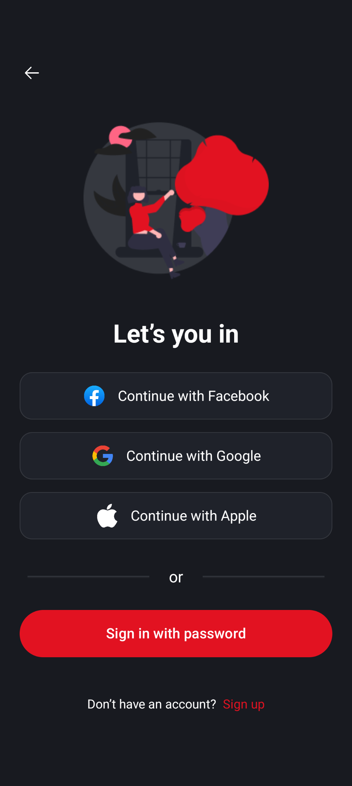
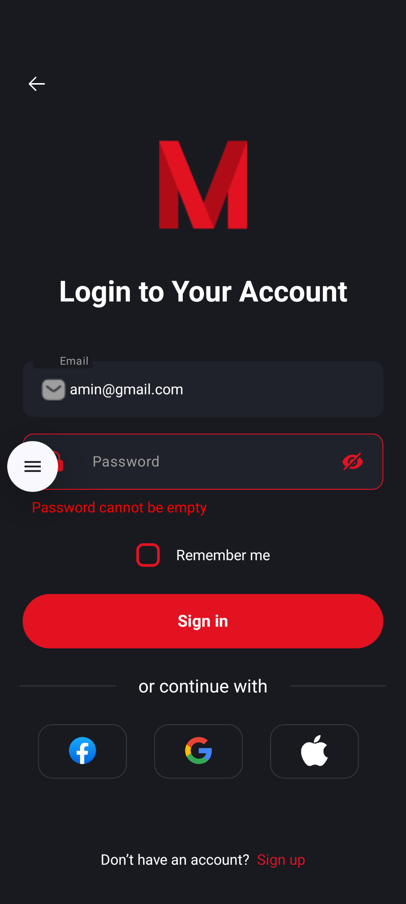
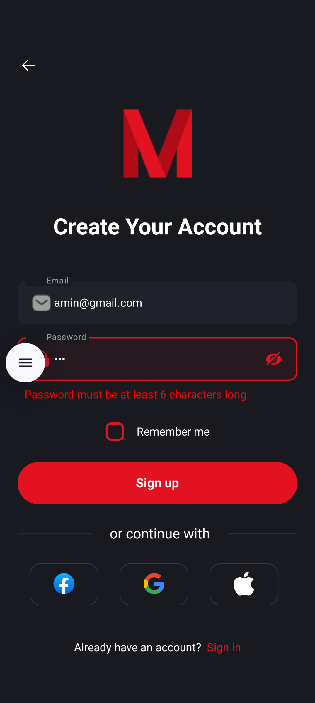

# 🎬 MovieApp Register Screens (Jetpack Compose)

**MovieApp** is a modern Android application built with Kotlin and Jetpack Compose, designed for movie enthusiasts to register and authenticate using email/password or social media. It leverages Firebase Authentication, Hilt for dependency injection, and follows Clean Architecture principles for a scalable and maintainable codebase.

---

## 📸 Screenshots

| Register Choices       | Sign In                | Sign Up                |
|-----------------------|-----------------------|-----------------------|
|  |  |  |

---

## 📱 Key Screens & Features

- **RegisterChoicesScreen**: Entry point for users to choose between signing in with email/password or social media (Facebook, Google, Apple).
- **SignInScreen**: Allows users to log in with email and password, featuring:
  - Real-time input validation
  - "Remember me" checkbox
  - Password visibility toggle
  - Loading overlay during authentication
  - Error/success messages
- **SignupScreen**: Enables new users to create an account with email and password, with similar features to SignInScreen.
- **Social Media Integration**: UI support for Facebook, Google, and Apple login (backend integration pending).
- **Navigation**: Seamless screen transitions using Jetpack Navigation Compose.

---

## 🧠 Technologies Used

| Technology              | Purpose                              |
|-------------------------|--------------------------------------|
| **Kotlin**              | Core programming language           |
| **Jetpack Compose**     | Modern UI toolkit                   |
| **Hilt**                | Dependency injection                |
| **Firebase Auth**       | Email/password authentication       |
| **Navigation Component**| Screen navigation and backstack     |
| **Coroutines**          | Asynchronous operations             |
| **SharedPreferences**   | Store registration status           |
| **Material Design 3**   | UI design system                    |

---

## ⚙️ Core Features

- ✅ Sign in and sign up with email and password via Firebase Authentication
- ✅ Real-time input validation for email and password
- ✅ "Remember me" functionality using SharedPreferences
- ✅ Password visibility toggle
- ✅ Social media login UI (Facebook, Google, Apple)
- ✅ Loading overlay during authentication
- ✅ Error and success message handling
- ✅ Dark theme with Material Design 3 components

---

## 🧱 Project Architecture

### 🧩 Clean Architecture (with Coroutines)

#### 1. **UI Layer**
- Jetpack Compose screens (`MainActivity`, `RegisterChoicesScreen`, `SignInScreen`, `SignupScreen`)
- ViewModels (`SignInViewModel`, `SignupViewModel`) using `StateFlow` for reactive UI updates
- Navigation handled via Jetpack Navigation Compose

#### 2. **Domain Layer**
- Use Cases: `SignInUseCase`, `SignUpUseCase`, `ValidateAuthFieldsUseCase`, `SaveRegisterUseCase`
- Interfaces: `AuthRepository`, `SharedPreferenceRepository`
- Pure Kotlin classes with suspend functions for coroutine support

#### 3. **Data Layer**
- Repositories: `SharedPreferenceRepositoryImpl` for SharedPreferences
- Firebase integration via `FirebaseModule` for authentication
- Suspend functions for asynchronous operations

---

## 🔁 Coroutine Flow

- ViewModels use `StateFlow` to manage UI state (`email`, `password`, `validationState`, `authState`)
- UseCases handle asynchronous authentication with coroutines
- Firebase Authentication operations are executed in `viewModelScope`

---

## 🚀 Getting Started

### Prerequisites
- Android Studio (latest stable version)
- Kotlin 1.9.0 or higher
- Minimum API: 26 (Android 8.0 Oreo)
- Firebase project with Authentication enabled

### Setup Instructions
1. **Clone the Repository**:
   ```bash
   git clone https://github.com/yourusername/movieapp.git
